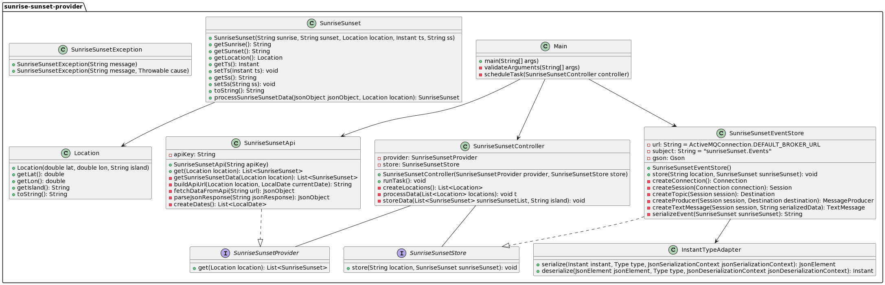
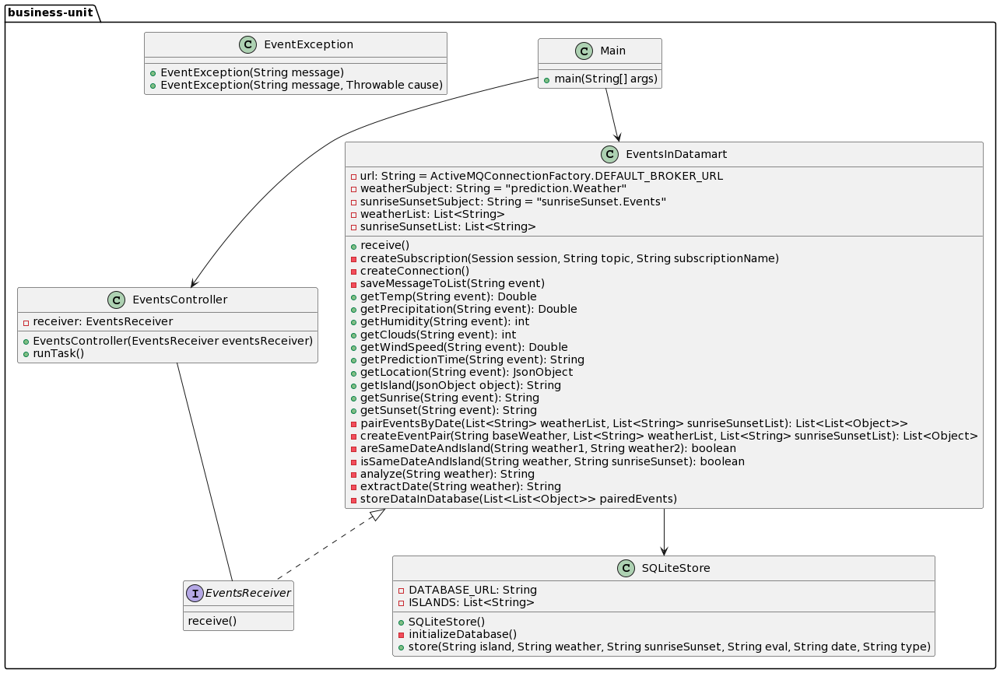
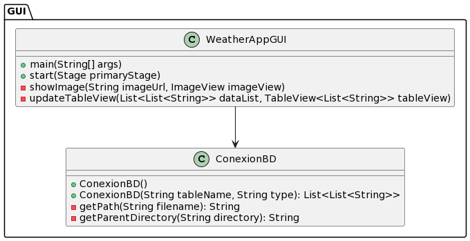

# Best Sunrise Sunset Places

## Assignment Details
- **Title:** Best Sunrise Sunset Places
- **Subject:** Desarrollo de aplicaciones para ciencia de datos
- **Student:** Luis Perera Pérez
- **Year:** 2023/2024
- **Degree:** Grado de Ingeniería en Ciencia de Datos
- **School:** Escuela Universitaria de Informática
- **University:** Universidad de Las Palmas de Gran Canaria

## Summary of Functionality
The project implements the Publisher/Subscriber pattern using ActiveMQ. It consists of five main modules: Prediction Provider, Datalake Builder, SunriseSunset Provider, Business Unit, and an ActiveMQ-based Broker. The Prediction Provider fetches weather data, transforms it into events, and publishes them to a topic on the Broker, the same with the sunriseSunset. The Datalake Builder subscribes to those topics and stores the events in a directory organized by date.  And the Business Unit subscribes those topics and matches the events according to date and place, to rate how good is that option to see the sunrise or sunset, then stores them in a datamart.
There is also another module, GUI, which is the user interface, in this one what we do is to show the sunrise or sunset of the island you select, accessing the datamart to show you the data.

## Resources Used
- **Development Environment:** IntelliJ IDEA
- **Version Control:** Git, GitHub
- **Documentation:** Markdown

## Design
### Classes and Relationships
- prediction-provider module diagram

- sunrise-sunset-provider module diagram

- data-lake module diagram

- data-lake module diagram

- GUI module diagram

### Design Principles and Patterns
- Implementation of the Publisher/Subscriber pattern.
- Each class has a clear and specific responsibility.
- Code is designed to be easily extended without modifying existing code.
- Principles of modularity, cohesion, and loose coupling are followed.

## How to Run

### Prerequisites
- Java 17 or later
- Maven
- OpenWeatherMap API Key
- Apache ActiveMQ installed and running
- JavaFX

### Steps
1. Clone the repository.
2. Navigate to the project directory.
3. Build the project with Maven.
4. Navigate to the target directory.
5. Run the Datalake Builder module.
6. Run the Business Unit module.
7. Run the Prediction Provider module with your OpenWeatherMap API Key.
8. Run the Sunrise Sunset Provider module with your RapidApi API Key.
9. Go to the shell and navigate to GUI directory.
10. Ejecute mvn javafx:run
---
