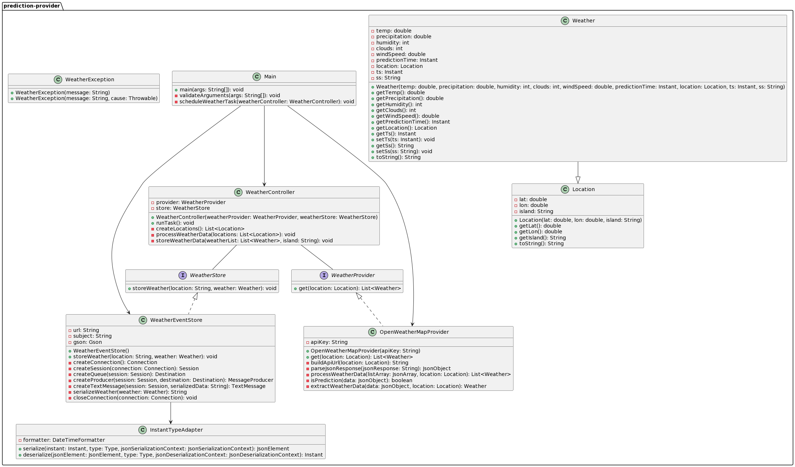
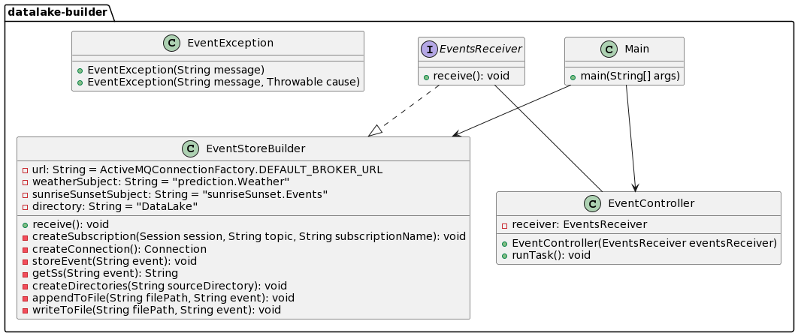

# Publisher/Subscriber with ActiveMQ

## Assignment Details
- **Title:** Weather Data Capture
- **Subject:** Desarrollo de aplicaciones para ciencia de datos
- **Student:** Luis Perera Pérez
- **Year:** 2023/2024
- **Degree:** Grado de Ingeniería en Ciencia de Datos
- **School:** Escuela Universitaria de Informática
- **University:** Universidad de Las Palmas de Gran Canaria

## Summary of Functionality
The project implements the Publisher/Subscriber pattern using ActiveMQ. It consists of three main modules: Prediction Provider, Event Store Builder, and an ActiveMQ-based Broker. The Prediction Provider fetches weather data, transforms it into events, and publishes them to a topic on the Broker. The Event Store Builder subscribes to this topic and stores the events in a directory organized by date.

## Resources Used
- **Development Environment:** IntelliJ IDEA
- **Version Control:** Git, GitHub
- **Documentation:** Markdown

## Design
### Classes and Relationships
- prediction-provider module diagram

- event-store-builder module diagram

### Design Principles and Patterns
- Implementation of the Publisher/Subscriber pattern.
- Each class has a clear and specific responsibility.
- Code is designed to be easily extended without modifying existing code.
- Principles of modularity, cohesion, and loose coupling are followed.

## How to Run

### Prerequisites
- Java 17 or later
- Maven
- OpenWeatherMap API Key
- Apache ActiveMQ installed and running

### Steps
1. Clone the repository.
2. Navigate to the project directory.
3. Build the project with Maven.
4. Navigate to the target directory.
5. Run the Prediction Provider module with your OpenWeatherMap API Key. 
6. Run the Event Store Builder module.
---
